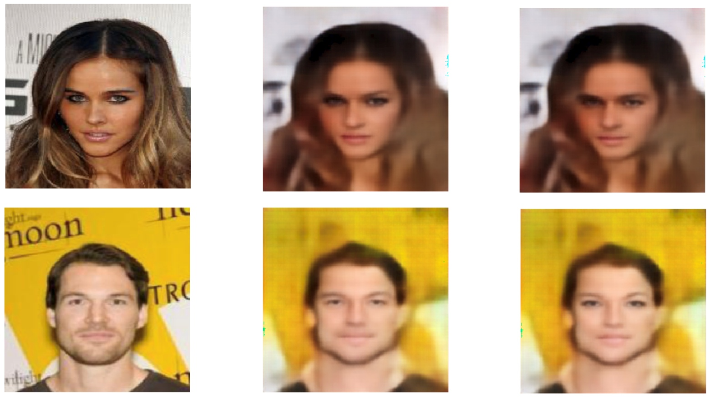

# FaderNetworks
Попытка использования подхода, описанного в [статье](https://arxiv.org/pdf/1706.00409.pdf)

В качестве атрибутов изображения из датасета CelebA были выбраны такие бинарные признаки, как пол, юность, блондинистость и привлекательность. 

Данные 4 признака добавлялись в качестве дополнительного фильтра к латентным переменным изображения. 

Обучение осуществлялось на 5000 тысячах случайных изображений датасета. На первом этапе происходило обучение автоэнкодера восстанавливать исходное изображение, а дискриминатора определять признаки по эмбеддингам изображения. После 1000 эпох(~5 часов на GPU) уровень восстановления составил ~0.003 MSE. Затем происходило дообучение модели для инвариантности эмбеддингов по отношению к атрибутам: функция потерь автоэнкодера начинала зависеть от вероятности ошибки дискриминатора. При этом множитель, определяющий компромисс между качеством восстановления автоэнкодера и инвариантности эмбеддингов по отношению к атрибутам менялся по расписанию: увеличивался на 2e-10 каждую итерацию. Такое дообучение заняло ~ 10 часов и привело к тому, что модель научилась изменять пол:
 

**Попробуйте также [cpu-версию предобученной модели](https://github.com/ga-gospodinov/FaceGeneration/blob/master/FaderNetwork/demo.ipynb)** (необходимы [pytorch](https://pytorch.org/) и [CelebA](https://www.kaggle.com/jessicali9530/celeba-dataset))

Код обучения модели в очень сыром виде лежит [здесь](./fitting.ipynb)
